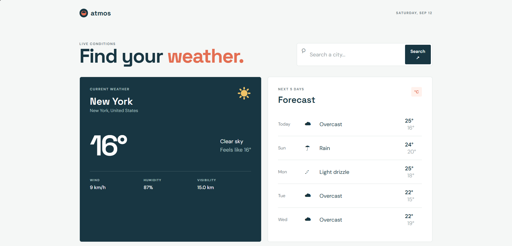

# Weather App

A clean, responsive weather application built with **vanilla HTML, CSS, and JavaScript** — no frameworks, no build tools, no API keys required.

Search any city and get real-time current conditions plus a 5-day forecast, powered by the free [Open-Meteo](https://open-meteo.com/) API.

## Features

- Search weather by city name (worldwide)
- Current temperature with "feels like" reading
- Humidity, wind speed, and visibility details
- 5-day forecast with daily highs and lows
- Weather-specific icons (sun, rain, snow, thunderstorm, etc.)
- No API key needed — works instantly
- Responsive layout for mobile and desktop
- Lightweight — no dependencies, no build step

## Demo

[Live Demo](https://your-username.github.io/weather-app) <!-- replace with your link -->



## Built With

- **HTML5** — Semantic structure
- **CSS3** — Flexbox, responsive design, loading states
- **JavaScript (ES6)** — Async/await, fetch API, DOM manipulation
- **[Open-Meteo API](https://open-meteo.com/)** — Free weather data (no key required)

## Installation

1. Clone the repository:
   ```bash
   git clone https://github.com/your-username/weather-app.git